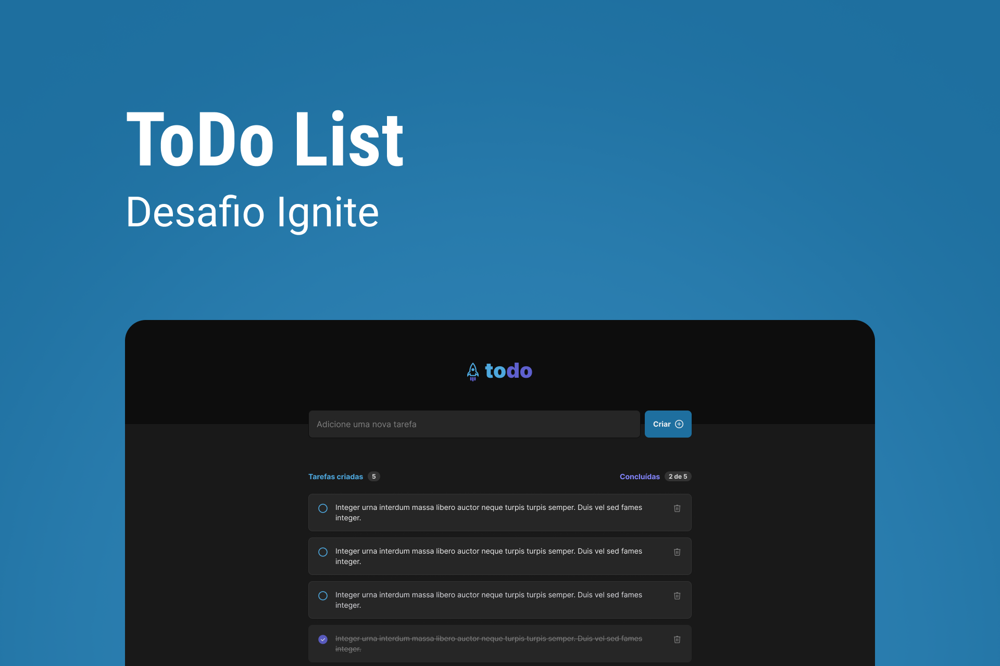
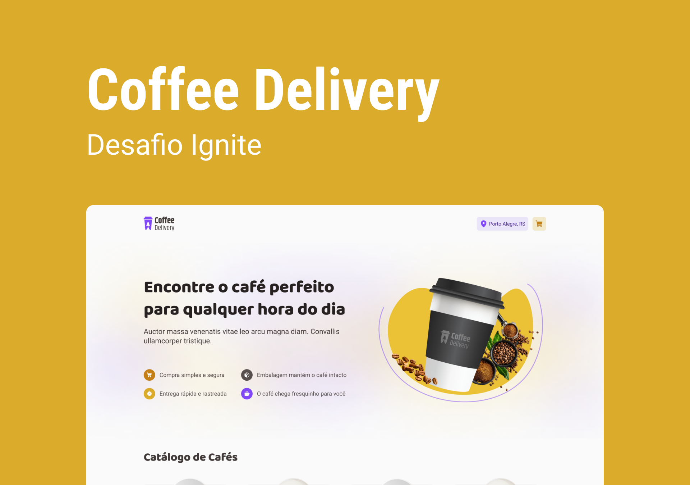
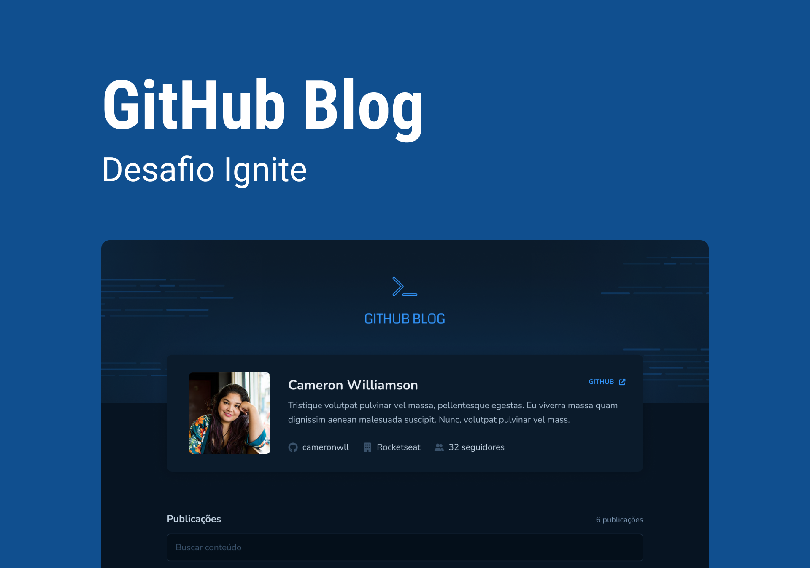

# Desafios Ignite React 2022 

Repositório destinado a armazenar todas as resoluções dos desafios que desenvolvi.

 

&nbsp;

## Desafio 01 - To-Do List

Durante este desafio, utilizamos os conceitos básicos do React desenvolvendo do zero uma simples lista de tarefas com as opções de criar e apagar um item da lista.

### 🛠️ Nesse projeto foi utilizado

- [Vite](https://vitejs.dev/)
- [ReactJS](https://reactjs.org/)
- [TypeScript](https://www.typescriptlang.org/)
- CSS Modules

 

&nbsp;

## Desafio 02 - Coffee Delivery

Durante este desafio, utilizamos conceitos um pouco mais avançados desenvolvendo do zero uma aplicação de encomenda de cafés! A aplicação conta com 3 telas sendo a primeira uma tela de apresentação e também de listagem dos cafés disponíveis. Na segunda tela, o usuário precisa preencher um formulário com seus dados de endereço e ao lado direito é possível visualizar os itens do carrinho, podendo alterar a quantidade ou remover o mesmo. Na terceira e última tela, é exibido uma confirmação do pedido e também os detalhes de entrega da compra.

### 🛠️ Nesse projeto foi utilizado

- [Vite](https://vitejs.dev/)
- [ReactJS](https://reactjs.org/)
- [Context API](https://reactjs.org/docs/context.html)
- [TypeScript](https://www.typescriptlang.org/)
- [Styled Components](https://styled-components.com/)
- [React Router Dom](https://reactrouter.com/en/main)
- [React Hook Form](https://react-hook-form.com/)
- [Validações de formulário com Zod](https://github.com/colinhacks/zod)
- [Via cep](https://viacep.com.br/)

 

&nbsp;

&nbsp;

## Desafio 03 - Github Blog

Durante este desafio, desenvolvemos uma aplicação que utiliza a API do GitHub para buscar issues de um repositório, dados do perfil e exibir elas como um blog.

### 🛠️ Nesse projeto foi utilizado

- [Vite](https://vitejs.dev/)
- [ReactJS](https://reactjs.org/)
- [TypeScript](https://www.typescriptlang.org/)
- [Styled Components](https://styled-components.com/)
- [React Router Dom](https://reactrouter.com/en/main)
- [React Hook Form](https://react-hook-form.com/)
- [Validações de formulário com Zod](https://github.com/colinhacks/zod)
- [Axios](https://axios-http.com/ptbr/docs/intro)
- [API do Github](https://docs.github.com/pt/rest?apiVersion=2022-11-28)

 

&nbsp;

Feito com 💜 por Ivo Pereira ✌🏽 [Entre em contato ](https://www.linkedin.com/in/ivopereira-jr/)
